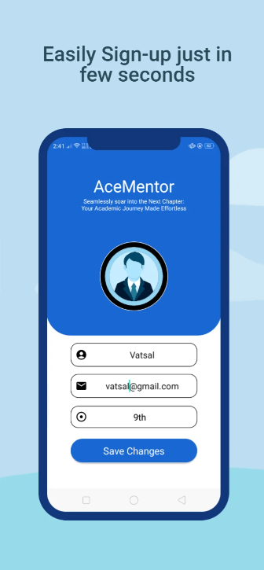
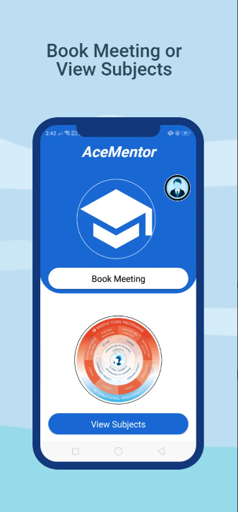
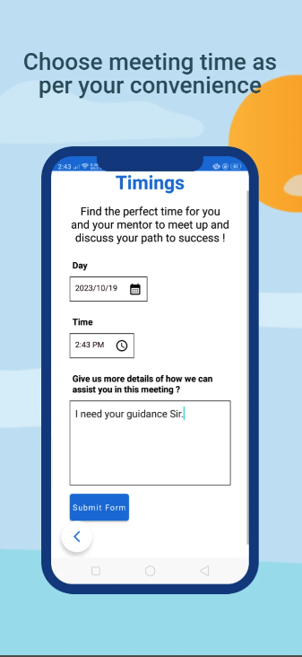

### PlayStore Link :- [https://play.google.com/store/apps/details?id=com.your.new.ace.ib&hl=en-IN)
# ACE_MENTOR
AceMentor is a great app for those children who needs any help from their seniors or mentors but they don't have proper guidance, so these children can easily use AceMentor for finding the proper mentor regarding their subject. A user can register in app as a mentor or as a student. If a user register himself as mentor so he can guide the student's (juniors). Basically students will send request to the mentors regarding the help needed.

 

# ACE MENTOR APPLICATION
## Screenshots

